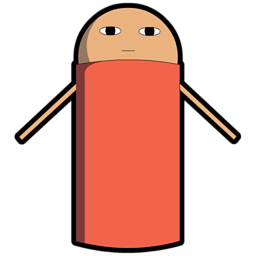
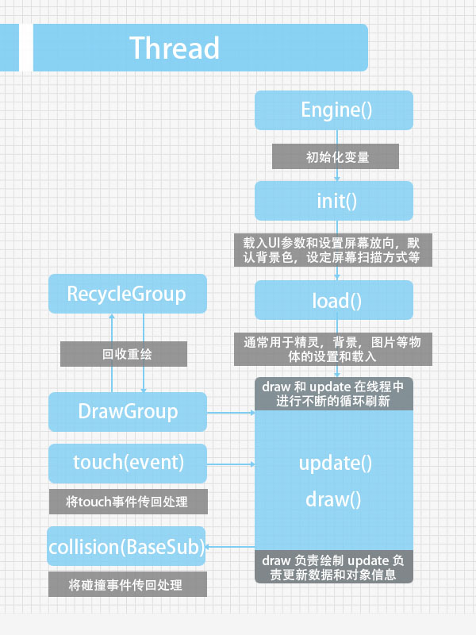
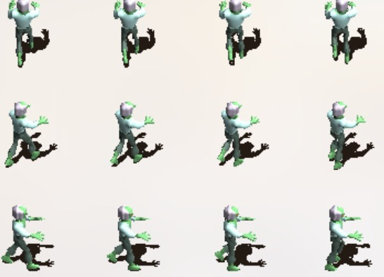
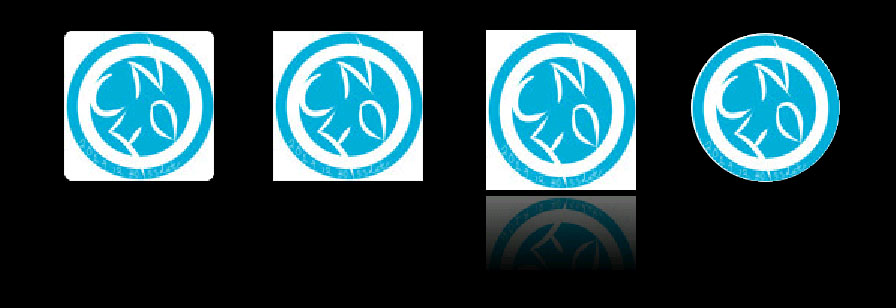

# JustWeEngine - Android FrameWork
An easy open source Android Native Game FrameWork.   
  
[](https://android-arsenal.com/details/1/2903)[ ](https://jitpack.io/#lfkdsk/JustWeEngine)

## Game core graph  
  
## How To Import?  
* Import Engine as Library to use;
* OR Import *.jar in "/jar";  
* OR use Gradle to build:  
  * Step 1. Add the JitPack repository to your build file  
  Add it in your root build.gradle at the end of repositories:  
  
  ``` groovy  
  
    	allprojects {
			repositories {
				...
				maven { url "https://jitpack.io" }
			}
		}
   	
  ```
  
  * Step 2. Add the dependency  on
  
  
  ``` groovy
  
      dependencies {
	        compile 'com.github.lfkdsk:JustWeEngine:v1.03'
	  }
		
  ```
* OR use Maven to build:  
  * Step 1. Add the JitPack repository to your build file  
  
  ``` xml
  
    <repositories>
		<repository>
		    <id>jitpack.io</id>
		    <url>https://jitpack.io</url>
		</repository>
	</repositories>
  
  ```
  
  * Step 2. Add the dependency  
  
  ``` xml
  	
    <dependency>
	    <groupId>com.github.lfkdsk</groupId>
	    <artifactId>JustWeEngine</artifactId>
	    <version>v1.03</version>
	</dependency>
	
  ```

## Engine come to V1.03

PlaneGame Demo：[Demo](https://github.com/lfkdsk/EngineDemo)  
OtherTools：[JustWeTools](https://github.com/lfkdsk/JustWeTools)  
Web Demo：[JustWe-WebServer](https://github.com/lfkdsk/JustWe-WebServer)  

## Quick Start 

* [1.Basic Function](#1basic-function)
	* [1.1Extend Engine Class](#11extend-engine-class)
	* [1.2Draw Text](#12draw-text)
	* [1.3Draw Picture](#13draw-picture)
	* [1.4Use Sprite](#14use-sprite)
	* [1.5Use Button](#15use-button)
* [2.Animation System](#2animation-system)
	* [2.1Animation Bind on BaseSub](#21animation-bind-on-basesub)
	* [2.2Animation Bind on Button](#22animation-bind-on-button)
* [3.Object collision detection and death decision](#3object-collision-detection-and-death-decision)
* [4.Type of screen scan](#4type-of-screenscan)
* [5.Tools](#5Tools)
* [6.Music System](#6music-system)  
	* [6.1Play short Sound](#61play-short-sound)
	* [6.2Play Music](#62play-music)
	* [6.3Compose with short sound](#63compose-with-short-sound)

## Advanced Application
* [7.Use Internet](#7use-internet)  
* [8.Use State Machine Sprite](#8use-state-machine-sprite)  
* [9.CrashHandler](#9crash-handler)
* [10.Use BlueTooth](#10use-bluetooth)
    * [10.1Open/Close Server](#101openclose-server)
    * [10.2Scan Devices](#102scan-devices)
    * [10.3Send Message](#103send-message)  
    
## Extend Method
* [Draw by yourselves](#draw-by-yourselves)

### 1.Basic Function
#### 1.1Extend Engine Class： 

   This FrameWork's all screen use SurfaceView to draw, never use other Android views like Button or Layout, so you should new a class extent Engine class, 
   It will control game's flow path.I had note the function in the code.
   
``` java  

	public class Game extends Engine {
	// Please init your var in constructor.
    public Game() {
    	// If open debug mode. If you open debug mode, you can print log, frame number, and parse on screen.
        super(true);
        
    }
	
	// load some UI parameters. And set screen direction, default background color, set screen's scan method.
    @Override
    public void init() {
    	// init UI default par, you must use at here . Some var in UIdefaultData for more phones should be init.
        UIdefaultData.init(this);
    }

	// load sprite , background , picture and other BaseSub
    @Override
    public void load() {

    }

	// draw and update in a new Thread
	// update message and sprite's msg
    @Override
    public void draw() {

    }

    @Override
    public void update() {

    }
	
	// receive touch event , its function depend on screen's scan mode.
    @Override
    public void touch(MotionEvent event) {

    }
    
	// receive collision event , BaseSub is the father class of all the sprites and others.
	// use to solve collision event default use rect collision.
    @Override
    public void collision(BaseSub baseSub) {

    }
    }

```   
  
#### 1.2Draw Text：
    
Use GamePrinter to draw text, in addition to some other methods to draw.
  
``` java

    @Override
    public void draw() {
        Canvas canvas = getCanvas();
        GameTextPrinter printer = new GameTextPrinter(canvas);
        printer.drawText("Hello", 100, 100);
    }
    
```  
Picture：  
  

#### 1.3Draw Picture：
Please put your pic in asset.

``` java  
	GameTexture texture = new GameTexture(this);
	texture.loadFromAsset("pic/logo.jpg")
	texture.draw(canvas, 100, 100);
```  

Picture：    
  
And you can use `loadFromAssetStripFrame` to get a pic from a large picture.

``` java

	/**
     * get bitmap from a big bitmap
     *
     * @param filename
     * @param x
     * @param y
     * @param width
     * @param height
     * @return
     */
    public boolean loadFromAssetStripFrame(String filename,
                                           int x, int y,
                                           int width, int height)
```  

Such as you can get a plane with this four par.
  
  
PicUtils have many functions to compress and solve Bitmap.

#### 1.4Use Sprite：
  If you want add a sprite , you can use BaseSprite or extend it , BaseSprite have lots of functions for animation, many of them should be used with animation system, I will introduce it later.
##### New a Sprite：
  1.Simple init:  
  
  ``` java
  
          sprite = new BaseSprite(this);
          
  ```
  
  2.Init with Frame Animation：  
  Init with Frame Animation need pic like this:  
  
  
  ``` java 
  
        GameTexture texture = new GameTexture(this);
        texture.loadFromAsset("pic/zombie.png");
        // w,h,lines
        sprite = new BaseSprite(this, 96, 96, 8);
        sprite.setTexture(texture);
        sprite.setPosition(100, 100);
        sprite.setDipScale(100, 100);
        // use FrameAnimation is important
        sprite.addAnimation(new FrameAnimation(0, 63, 1));
        addToSpriteGroup(sprite);
        
  ```
  
  picture:  
    
  
  3.Init with Frame Animation(Pics from an large Bitmap)： 
  ``` java  
  
    	// new an large Picture
        GameTexture texture = new GameTexture(this);
        texture.loadFromAsset("pic/shoot.png");
        // Init width,height,and mode.
  		ship = new BaseSprite(this, 100, 124, FrameType.COMMON);
  		// set large pic
        ship.setTexture(texture);
        // get two frame in pic
        ship.addRectFrame(0, 100, 100, 124);
        ship.addRectFrame(167, 361, 100, 124);
        ship.addAnimation(new FrameAnimation(0, 1, 1));

  ```
  picture(two frames change quickly):  
    

  4.Some other important settings：
    
  ``` java  
  
  	  // set bitmap
  	  ship.setTexture(texture);
  	  // get Frame from bitmap
  	  ship.addRectFrame(0, 100, 100, 124);
  	  // set position
  	  ship.setPosition(x, y);
  	  // set w,h with dp(Can scale)
      ship.setDipScale(96, 96);
      // set position with dp(Can scale)
	  ship.setDipPosition(x, y);
	  // set alpha transparency value
	  ship.setAlpha(...);
	  // add Sprite to Group. Only use this Function your sprite can draw automatically.
	  addToSpriteGroup(ship);
	  ...
	  
  ``` 

#### 1.5Use Button：  
  If you want to use Button, you can extent the BaseButton, and also you can straightly use TextureButton and TextButton.
  Button's API is like Android's, you can set onClick with this interface:  
  
  ``` java  
  
  		button.setOnClickListener(new OnClickListener() {
          @Override
          public void onClick() {
              Log.e("button", "onClick");
          }
        });
        
  ```  
  
  1.TextureButton: 
   
  ``` java  
  
      TextureButton button;
      // Init and set Button's Name.
      button = new TextureButton(this, "logo");
	  texture = new GameTexture(this);
      texture.loadFromAsset("pic/logo.jpg");
      // Add pic
      button.setTexture(texture);
      // button's interface
      button.setOnClickListener(new OnClickListener() {
          @Override
          public void onClick() {
              Log.e("button", "onClick");
          }
        });
      button.setPosition(200, 300);
      button.setDipScale(100, 150);
      // add to button group to draw and update
      addToButtonGroup(button);

  ``` 
  picture:  
    
    Combined with PicUtil in a variety of Bitmap processing methods can be easy to make a variety of styles of Button：  
    
  
  2.TextButton:  
  
  ``` java  
  	  
      TextButton button;  
      button = new TextButton(this, "logo");
      button.setText("刘丰恺");
      addToButtonGroup(button);
      // other functions in code.
	  ...
	  
  ```
  picture：  
  

### 2.Animation System  
  Now Animation System, you can use Some Animations extent BaseAnimation, and you can also extent BaseAnim by yourself.
#### 2.1Animation Bind on BaseSub  
AnimType save the type of Animations.

| Animation     | method        |function|
| ------------- |:-------------:|-------:|
| AliveAnimation|adjustAlive(boolean ori) | If sprite is alive |
| AlphaAnimation|adjustAlpha(int ori)     | change sub's alpha              |
| CircleMoveAnimation | adjustPosition(Float2 ori)| circle run with a point |
| FenceAnimation | adjustPosition(Float2 ori)| limit Sub in screen |
| FrameAnimation | adjustFrame(int ori) | Frame Animation |
| MoveAnimation | adjustPosition(Float2 ori) | Move  |
| SpinAnimation | adjustRotation(float ori) | Spin |
| ThrobAnimation | adjustScale(Float2 ori) | Throb |
| VelocityAnimation | adjustPosition/adjustAlive | Velocity for one direction |
| WrapMoveAnimation | adjustPosition(Float2 ori) | move to another corner of screen |
| ZoomAnimation | adjustScale(Float2 ori) | zoom Sprite |
| more | ... | ... |

ListAnimation:Animation can loop work automatically;
FixedAnimation:Animation can work by call its name.
Such as Frame Animation is a ListAnimation.And follow the plane coming in is a FixAnimation.

``` java

        ship.addfixedAnimation("start",
                new MoveAnimation(UIdefaultData.centerInHorizontalX -   ship.getWidthWithScale() / 2,
                        UIdefaultData.screenHeight - 2 * ship.getHeightWidthScale(), new Float2(10, 10)));
           
```

picture:  
  

#### 2.2Animation Bind on Button  
BaseButtonAnimation is Animation for button ,which extent BaseAnim.

| Animation        | method           | function  |
| ------------- |:-------------:| -----:|
| ZoomCenterButtonAnim |adjustButtonRect(Rect ori,boolean touchType) | click zoom |
| ColorAnimation|adjustButtonBackGround(int ori,boolean type)| TextButton click change color |
| more | ... | ... |

set ZoomCenterButtonAnim for BUtton:  

``` java

	// set zoom in center
    button.setZoomCenter(true);
    // three par, The initial value / value / amplification frames
    button.setAnimation(new ZoomCenterButtonAnim(10, 30, 3));
	
```

picture:  
    

set ColorAnimation for Button:  

``` java

	// init color / click color
	button.setAnimation(
       new ColorAnimation(UIdefaultData.colorAccent,
       UIdefaultData.colorPressed));

```
picture:  
    

### 3.Object collision detection and death decision:    
Use ID and Name,we can make Sprites in different groups and have their own name,Engine core class will check different group.

``` java

	final int SHIP = 0;
	ship.setName("SHIP");
    ship.setIdentifier(SHIP);

```

If you use `addToSpriteGroup(sprite)` for a sprite, it will find collision automatically, and callback event at here.

``` java

    @Override
    public void collision(BaseSub baseSub) {
    	// get Sub collide with It.
        BaseSprite other = (BaseSprite) baseSub.getOffender();
        // get Group Name
        if (baseSub.getIdentifier() == BULLET &&
                other.getIdentifier() == ENEMY) {
            // set dead
            other.setAlive(false);
            // recycle or auto
            removeFromSpriteGroup(other);
            addToRecycleGroup(other);
        }
    }
    
```
 
You can use `getOffender()` get Sub collide with It,and use `getIdentifier()` get Group, then solve them.
If you open Debug mode , you can see the collided line.  
picture:  

### 4.Type of screen scan  
It's used to give priority to the response of the screen, click, Button, and multi touch, and placed in different situations can optimize the screen refresh.  

``` java

  	// find single touch
  	SINGLE,
  	// find click button
    BUTTON,
    // find more than one touch
    FULL,
    // find single touch and click button
    SINGLE_BUTTON
  
```  

set It like this:  

``` java
	
	super.setTouchMode(TouchMode.BUTTON);

``` 


### 5.Tools  
   * `NetUtils` NetTools
   * `PicUtils` Picture Tools
   * `ServiceUtils` Service Tools
   * `ImageHelper` Image Tools  
   * `DisplayUtils` Date canvert Tools
   * `SpUtils` simple Sp（`Can save list and map`）
   * `ValidatorsUtils` Validators Tools  

### 6.Music System  
#### 6.1Play short Sound 
Play short Sound，Init `SoundManager` to load Sound .  
``` java

	// Context and size of Manager
    SoundManager manager = new SoundManager(this, 5);
    // get Sound from assets , and url will be save too.
	manager.addSound("mic/open.mid");
	// play with name
	manager.play("mic/open.mid");
	
	
```

You can play a sound like this, but please use short sound. If you want to play background music, please read following.

``` java

	public void removeSound(String musicName) // remove
	public void play(String musicName, float volume) // play with volume
	public boolean containSoundID(int soundID) // find if exist
	public int getSoundID(String soundName)  // get music ID
	...


```  
#### 6.2Play Music  
Play Music fix play music such as background music.  

``` java  

	// context and url
	MusicPlayer player = new MusicPlayer(this, "mic/open.mp3");
    player.play();

```  

some other methods.

``` java  

	public void dispose() // clear
	public void setLooping(boolean isLooping) // is loop?
	public void setVolume(float volume) // set volume
	...
	
```  

#### 6.3Compose with short sound  
Set some sounds in `SoundManager` and play quickly to compose.

``` java 

    SoundManager manager = new SoundManager(this, 5);
    manager.addSound("mic/1.mid");
    manager.addSound("mic/2.mid");
    SoundPlayer player = new SoundPlayer(manager, 500, 16);
    player.addSound("mic/1.mid");
    player.addSound("mic/2.mid");
    ... 

```

use `player.play();` to play.


### 7.Use Internet
You can use Internet like this Demo.[JustWe-WebServer](https://github.com/lfkdsk/JustWe-WebServer).
use like:
 
``` java
  
        server.apply("/lfk", new OnWebStringResult() {
            @Override
            public String OnResult() {
                return "=======";
            }
        });

        server.apply("/main", new OnWebFileResult() {
            @Override
            public File returnFile() {
                return new File(WebServerDefault.WebServerFiles+"/"+"welcome.html");
            }
        });
        
```  
        
You can bind router like this way, if you want to send msg, you can straightly use HTTP Get/Post.

### 8.Use State Machine Sprite

``` java

    // add a new state to sprite
    sprite.addState(new StateFinder() {
        @Override
        public boolean isContent(BaseSub baseSub) {
            return Math.abs(zom.s_position.x - baseSub.s_position.x) > 50;
        }
    }, new FrameAnimation(0, 63, 1));

```
  
You can add a task to the state machine wizard by the addState method above, and only when the return value of the first parameter interface callback is true,
Will run second parameters to provide the instruction, if the return is false will run the second state of the judgment.
The priority of the state is provided by the join order.

picture:  
    

### 9.CrashHandler  
CrashHandler is used to deal with the unexpected crash event of the game, and the initialization is recommended in Application.
CrashHandler can automatically save models and abnormal log in order to allow developers to find the problem.

``` java

    CrashHandler.getInstance().init(this);

```
You can use it like this.
And:

``` java
        
    CrashHandler.getInstance().setRestartActivity(MainActivity.class); // restartActivity
    CrashHandler.getInstance().setAfterCrashListener(new AfterCrashListener() {
        @Override
        public void AfterCrash() {  // set what to save
            ...
        }
    });    

```

### 10.Use BlueTooth

#### 10.1Open/Close Server
BlueTooth Use requires a new `BlueToothServer` object, the incoming context and the MessageBack interface.

``` java

        blueToothServer = new BlueToothServer(this, new OnMessageBack() {
            @Override
            public void getMessage(String msg) {
                Log.e("L", msg);
            }

            @Override
            public void sendMessage(String msg) {
                Log.e("L", msg);
            }

            @Override
            public void getDevice(ArrayList<String> msg) {
                Log.e("L", msg.size() + "");
            }
        });
		
		// init like this
        blueToothServer.init();

```  
After the service is initialized, such as not to open the Bluetooth, the system will automatically prompt application of Bluetooth enabled.
Through the MessageBack interface can be received to send, receive, and Devices Scan information, to take the corresponding operation can get data.
When closing the service, please use `blueToothServer.unBindService (); ` off service.

#### 10.2Scan Devices 
Using `blueToothServer.doDiscovery (); ` device scan, return the results in the OnMessageBack () interface
GetDevice () method to receive.
Use `blueToothServer.ensureDiscoverable (); allow to be scanned.
Use `blueToothServer.getPairedDevices (); return a list of paired devices.

#### 10.3Send Message
In the match after the success can be used `blueToothServer.sendMessage (String MSG);` Send Message.
At the same time, the message received from the getMessage (Interface) can also be obtained.


### Draw by yourselves
Can accept the user's drawing input, and to generate the wizard, background, or other objects：[How To Use？](https://github.com/lfkdsk/JustWeTools#paintview画图工具)  

## Feedback    
Please send your feedback as long as there occurs any inconvenience or problem. You can contact me with:

* Email:lfk_dsk@hotmail.com  
* weibo: [@亦狂亦侠_亦温文](http://www.weibo.com/u/2443510260)  
* Blog:  [刘丰恺](http://www.cnblogs.com/lfk-dsk/)  

## License

    Copyright 2015 [刘丰恺](http://www.cnblogs.com/lfk-dsk/)

    Licensed under the Apache License, Version 2.0 (the "License");
    you may not use this file except in compliance with the License.
    You may obtain a copy of the License at

       http://www.apache.org/licenses/LICENSE-2.0

    Unless required by applicable law or agreed to in writing, software
    distributed under the License is distributed on an "AS IS" BASIS,
    WITHOUT WARRANTIES OR CONDITIONS OF ANY KIND, either express or implied.
    See the License for the specific language governing permissions and
    limitations under the License.

