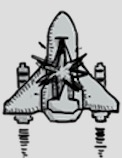
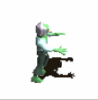
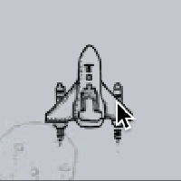
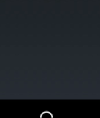

# JustWeEngine - Android FrameWork
An easy open source Android Native Game FrameWork.   
  
[](https://android-arsenal.com/details/1/2903)[ ](https://jitpack.io/#lfkdsk/JustWeEngine)

## Game core graph  
  
## How To Import?  
* Import Engine as Library to use;
* OR Import *.jar in "/jar";  
* OR use Gradle to build:  
  * Step 1. Add the JitPack repository to your build file  
  Add it in your root build.gradle at the end of repositories:  
  
  ``` groovy  
  
    	allprojects {
			repositories {
				...
				maven { url "https://jitpack.io" }
			}
		}
   	
  ```
  
  * Step 2. Add the dependency  on
  
  
  ``` groovy
  
      dependencies {
	        compile 'com.github.lfkdsk:JustWeEngine:v1.03'
	  }
		
  ```
* OR use Maven to build:  
  * Step 1. Add the JitPack repository to your build file  
  
  ``` xml
  
    <repositories>
		<repository>
		    <id>jitpack.io</id>
		    <url>https://jitpack.io</url>
		</repository>
	</repositories>
  
  ```
  
  * Step 2. Add the dependency  
  
  ``` xml
  	
    <dependency>
	    <groupId>com.github.lfkdsk</groupId>
	    <artifactId>JustWeEngine</artifactId>
	    <version>v1.03</version>
	</dependency>
	
  ```

## Engine come to V1.03

PlaneGame Demo：[Demo](https://github.com/lfkdsk/EngineDemo)  
OtherTools：[JustWeTools](https://github.com/lfkdsk/JustWeTools)  
Web Demo：[JustWe-WebServer](https://github.com/lfkdsk/JustWe-WebServer)  

## Quick Start 

* [1.Basic Function](#1BasicFunction)
	* [1.1Extend Engine Class](#11ExtendEngineClass)
	* [1.2Draw Text](#12DrawText)
	* [1.3Draw Picture](#13DrawPicture)
	* [1.4Use Sprite](#14UseSprite)
	* [1.5Use Button](#15UseButton)
* [2.Animation System](#2AnimationSystem)
	* [2.1Animation Bind on BaseSub](#21AnimationBindonBaseSub)
	* [2.2Animation Bind on Button](#22AnimationBindonButton)
* [3.Object collision detection and death decision](#3Objectcollisiondetectionanddeathdecision)
* [4.Type of screen scan](#4Type of screen scan)
* [5.Tools](#5Tools)
* [6.Music System](#6Music System)  
	* [6.1播放短音效](#61播放短音效)
	* [6.2播放音频](#62播放音频)
	* [6.3通过短音效编曲](#63通过短音效编曲)

## 进阶应用
* [7.使用网络](#7使用网络)  
* [8.使用状态机精灵](#8使用状态机精灵)  
* [9.CrashHandler崩溃守护](#9crashhandler崩溃守护)
* [10.使用蓝牙](#10使用蓝牙)
    * [10.1开启、关闭服务](#101开启关闭服务)
    * [10.2扫描设备](#102扫描设备)
    * [10.3发送消息](#103发送消息)  
    
## 拓展功能
* [允许玩家绘制](#允许玩家绘制)

### 1.Basic Function
#### 1.1Extend Engine Class： 

   This FrameWork's all screen use SurfaceView to draw, never use other Android views like Button or Layout, so you should new a class extent Engine class, 
   It will control game's flow path.I had note the function in the code.
   
``` java  

	public class Game extends Engine {
	// Please init your var in constructor.
    public Game() {
    	// If open debug mode. If you open debug mode, you can print log, frame number, and parse on screen.
        super(true);
        
    }
	
	// load some UI parameters. And set screen direction, default background color, set screen's scan method.
    @Override
    public void init() {
    	// init UI default par, you must use at here . Some var in UIdefaultData for more phones should be init.
        UIdefaultData.init(this);
    }

	// load sprite , background , picture and other BaseSub
    @Override
    public void load() {

    }

	// draw and update in a new Thread
	// update message and sprite's msg
    @Override
    public void draw() {

    }

    @Override
    public void update() {

    }
	
	// receive touch event , its function depend on screen's scan mode.
    @Override
    public void touch(MotionEvent event) {

    }
    
	// receive collision event , BaseSub is the father class of all the sprites and others.
	// use to solve collision event default use rect collision.
    @Override
    public void collision(BaseSub baseSub) {

    }
    }

```   
  
#### 1.2Draw Text：
    
Use GamePrinter to draw text, in addition to some other methods to draw.
  
``` java

    @Override
    public void draw() {
        Canvas canvas = getCanvas();
        GameTextPrinter printer = new GameTextPrinter(canvas);
        printer.drawText("Hello", 100, 100);
    }
    
```  
Picture：  
  

#### 1.3Draw Picture：
Please put your pic in asset.

``` java  
	GameTexture texture = new GameTexture(this);
	texture.loadFromAsset("pic/logo.jpg")
	texture.draw(canvas, 100, 100);
```  

Picture：    
  
And you can use `loadFromAssetStripFrame` to get a pic from a large picture.

``` java

	/**
     * get bitmap from a big bitmap
     *
     * @param filename
     * @param x
     * @param y
     * @param width
     * @param height
     * @return
     */
    public boolean loadFromAssetStripFrame(String filename,
                                           int x, int y,
                                           int width, int height)
```  

Such as you can get a plane with this four par.
  
  
PicUtils have many functions to compress and solve Bitmap.

#### 1.4Use Sprite：
  If you want add a sprite , you can use BaseSprite or extend it , BaseSprite have lots of functions for animation, many of them should be used with animation system, I will introduce it later.
##### New a Sprite：
  1.Simple init:  
  
  ``` java
  
          sprite = new BaseSprite(this);
          
  ```
  
  2.Init with Frame Animation：  
  Init with Frame Animation need pic like this:  
  
  
  ``` java 
  
        GameTexture texture = new GameTexture(this);
        texture.loadFromAsset("pic/zombie.png");
        // w,h,lines
        sprite = new BaseSprite(this, 96, 96, 8);
        sprite.setTexture(texture);
        sprite.setPosition(100, 100);
        sprite.setDipScale(100, 100);
        // use FrameAnimation is important
        sprite.addAnimation(new FrameAnimation(0, 63, 1));
        addToSpriteGroup(sprite);
        
  ```
  
  picture:  
    
  
  3.Init with Frame Animation(Pics from an large Bitmap)： 
  ``` java  
  
    	// new an large Picture
        GameTexture texture = new GameTexture(this);
        texture.loadFromAsset("pic/shoot.png");
        // Init width,height,and mode.
  		ship = new BaseSprite(this, 100, 124, FrameType.COMMON);
  		// set large pic
        ship.setTexture(texture);
        // get two frame in pic
        ship.addRectFrame(0, 100, 100, 124);
        ship.addRectFrame(167, 361, 100, 124);
        ship.addAnimation(new FrameAnimation(0, 1, 1));

  ```
  picture(two frames change quickly):  
    

  4.Some other important settings：
    
  ``` java  
  
  	  // set bitmap
  	  ship.setTexture(texture);
  	  // get Frame from bitmap
  	  ship.addRectFrame(0, 100, 100, 124);
  	  // set position
  	  ship.setPosition(x, y);
  	  // set w,h with dp(Can scale)
      ship.setDipScale(96, 96);
      // set position with dp(Can scale)
	  ship.setDipPosition(x, y);
	  // set alpha transparency value
	  ship.setAlpha(...);
	  // add Sprite to Group. Only use this Function your sprite can draw automatically.
	  addToSpriteGroup(ship);
	  ...
	  
  ``` 

#### 1.5Use Button：  
  If you want to use Button, you can extent the BaseButton, and also you can straightly use TextureButton and TextButton.
  Button's API is like Android's, you can set onClick with this interface:  
  
  ``` java  
  
  		button.setOnClickListener(new OnClickListener() {
          @Override
          public void onClick() {
              Log.e("button", "onClick");
          }
        });
        
  ```  
  
  1.TextureButton: 
   
  ``` java  
  
      TextureButton button;
      // Init and set Button's Name.
      button = new TextureButton(this, "logo");
	  texture = new GameTexture(this);
      texture.loadFromAsset("pic/logo.jpg");
      // Add pic
      button.setTexture(texture);
      // button's interface
      button.setOnClickListener(new OnClickListener() {
          @Override
          public void onClick() {
              Log.e("button", "onClick");
          }
        });
      button.setPosition(200, 300);
      button.setDipScale(100, 150);
      // add to button group to draw and update
      addToButtonGroup(button);

  ``` 
  picture:  
    
    Combined with PicUtil in a variety of Bitmap processing methods can be easy to make a variety of styles of Button：  
    
  
  2.TextButton:  
  
  ``` java  
  	  
      TextButton button;  
      button = new TextButton(this, "logo");
      button.setText("刘丰恺");
      addToButtonGroup(button);
      // other functions in code.
	  ...
	  
  ```
  picture：  
  

### 2.Animation System  
  Now Animation System, you can use Some Animations extent BaseAnimation, and you can also extent BaseAnim by yourself.
#### 2.1Animation Bind on BaseSub  
AnimType save the type of Animations.

| Animation     | method        |function|
| ------------- |:-------------:|-------:|
| AliveAnimation|adjustAlive(boolean ori) | If sprite is alive |
| AlphaAnimation|adjustAlpha(int ori)     | change sub's alpha              |
| CircleMoveAnimation | adjustPosition(Float2 ori)| circle run with a point |
| FenceAnimation | adjustPosition(Float2 ori)| limit Sub in screen |
| FrameAnimation | adjustFrame(int ori) | Frame Animation |
| MoveAnimation | adjustPosition(Float2 ori) | Move  |
| SpinAnimation | adjustRotation(float ori) | Spin |
| ThrobAnimation | adjustScale(Float2 ori) | Throb |
| VelocityAnimation | adjustPosition/adjustAlive | Velocity for one direction |
| WrapMoveAnimation | adjustPosition(Float2 ori) | move to another corner of screen |
| ZoomAnimation | adjustScale(Float2 ori) | zoom Sprite |
| more | ... | ... |

ListAnimation:Animation can loop work automatically;
FixedAnimation:Animation can work by call its name.
Such as Frame Animation is a ListAnimation.And follow the plane coming in is a FixAnimation.

``` java

        ship.addfixedAnimation("start",
                new MoveAnimation(UIdefaultData.centerInHorizontalX -   ship.getWidthWithScale() / 2,
                        UIdefaultData.screenHeight - 2 * ship.getHeightWidthScale(), new Float2(10, 10)));
           
```

picture:  
  

#### 2.2Animation Bind on Button  
BaseButtonAnimation is Animation for button ,which extent BaseAnim.

| Animation        | method           | function  |
| ------------- |:-------------:| -----:|
| ZoomCenterButtonAnim |adjustButtonRect(Rect ori,boolean touchType) | click zoom |
| ColorAnimation|adjustButtonBackGround(int ori,boolean type)| TextButton click change color |
| more | ... | ... |

set ZoomCenterButtonAnim for BUtton:  

``` java

	// set zoom in center
    button.setZoomCenter(true);
    // three par, The initial value / value / amplification frames
    button.setAnimation(new ZoomCenterButtonAnim(10, 30, 3));
	
```

picture:  
    

set ColorAnimation for Button:  

``` java

	// init color / click color
	button.setAnimation(
       new ColorAnimation(UIdefaultData.colorAccent,
       UIdefaultData.colorPressed));

```
picture:  
    

### 3.Object collision detection and death decision  
Use ID and Name,we can make Sprites in different groups and have their own name,Engine core class will check different group.

``` java

	final int SHIP = 0;
	ship.setName("SHIP");
    ship.setIdentifier(SHIP);

```

只要使用了`addToSpriteGroup(sprite)`的精灵对象就会自动进行碰撞检测，而对碰撞检测的结果会从
`collision`中进行发回。
``` java

    @Override
    public void collision(BaseSub baseSub) {
    	// 获取与之碰撞的对象
        BaseSprite other = (BaseSprite) baseSub.getOffender();
        // 获取ID分组处理
        if (baseSub.getIdentifier() == BULLET &&
                other.getIdentifier() == ENEMY) {
            // 设定死亡
            other.setAlive(false);
            // 回收
            removeFromSpriteGroup(other);
            addToRecycleGroup(other);
        }
    }
    
```

其中`getOffender()`获得与之碰撞的对象，通过`getIdentifier()`获取设定的对象分组，实行逻辑判断。
开启Debug模式会看见碰撞线。  
效果图:  

### 4.Type of screen scan  
Type of screen scan是用来优先响应屏幕点击、Button点击、和多点触控而设的，放置在不同情况下都能优化屏幕的刷新。  
``` java

  	// 检测单一移动
  	SINGLE,
  	// 检测Button
    BUTTON,
    // 多点检测
    FULL,
    // 单击＋Button
    SINGLE_BUTTON
  
```
并且通过如下方式进行设置:  

``` java
	
	super.setTouchMode(TouchMode.BUTTON);

``` 


### 5.Tools  
   * `NetUtils` NetTools
   * `PicUtils` Picture Tools
   * `ServiceUtils` Service Tools
   * `ImageHelper` Image Tools  
   * `DisplayUtils` Date canvert Tools
   * `SpUtils` simple Sp（`Can save list and map`）
   * `ValidatorsUtils` Validators Tools  

### 6.Music System  
#### 6.1播放短音效 
播放短音效，首先初始化`SoundManager`用以加载音效。  
``` java

	// 接收实例和Manager的尺寸
    SoundManager manager = new SoundManager(this, 5);
    // 从assets加载音频 同时加载路径也会作为音效名进行存储
	manager.addSound("mic/open.mid");
	// 通过加载名进行播放
	manager.play("mic/open.mid");
	
	
```

完成以上步骤就可以播放了，当然尽量只向其中放置较短的音效，如背景音乐的长音频，请见播放音频。  

``` java

	public void removeSound(String musicName) // 移除
	public void play(String musicName, float volume) // 播放 ＋ 音量
	public boolean containSoundID(int soundID) // 判断音频是否存在
	public int getSoundID(String soundName)  // 获取ID
	...


```  
#### 6.2播放音频  
播放音频适合例如背景音乐一样的音乐。  

``` java  

	// 传入两个参数 上下文和文件名
	MusicPlayer player = new MusicPlayer(this, "mic/open.mp3");
    player.play();

```  
以上的就能实现播放了，下面还有一些其他的方法。

``` java  

	public void dispose() // 清理
	public void setLooping(boolean isLooping) // 是否循环
	public void setVolume(float volume) // 设定音量
	...
	
```  

#### 6.3通过短音效编曲  
从`SoundManager`中导入多段音频，快速播放达成音效的效果。

``` java 

    SoundManager manager = new SoundManager(this, 5);
    manager.addSound("mic/1.mid");
    manager.addSound("mic/2.mid");
    SoundPlayer player = new SoundPlayer(manager, 500, 16);
    player.addSound("mic/1.mid");
    player.addSound("mic/2.mid");
    ... 

```

使用`player.play();`进行播放。


### 7.使用网络
网络的使用可参考[JustWe-WebServer](https://github.com/lfkdsk/JustWe-WebServer)中的介绍。
按照介绍操作就可以通过：
 
``` java
  
        server.apply("/lfk", new OnWebStringResult() {
            @Override
            public String OnResult() {
                return "=======";
            }
        });

        server.apply("/main", new OnWebFileResult() {
            @Override
            public File returnFile() {
                return new File(WebServerDefault.WebServerFiles+"/"+"welcome.html");
            }
        });
        
```  
        
这样的简单方式绑定路由，而get／post数据可以直接使用http协议的get和post进行。

### 8.使用状态机精灵

``` java

    // 为状态机添加一个任务
    sprite.addState(new StateFinder() {
        @Override
        public boolean isContent(BaseSub baseSub) {
            return Math.abs(zom.s_position.x - baseSub.s_position.x) > 50;
        }
    }, new FrameAnimation(0, 63, 1));

```
  
可以通过上述的addState方法为状态机精灵添加一个任务，只有当第一个参数接口回调的返回值为真的时候，
才会去运行第二个参数提供的指令，如果返回为假则会运行第二项状态的判断。
状态的优先级由加入顺序提供。

效果图:  
    

### 9.CrashHandler崩溃守护  
CrashHandler用于处理游戏的意外崩溃事件，初始化推荐在Application中进行。
CrashHandler可以自动保存机型和异常日志，以便让开发者找到问题所在。

``` java

    CrashHandler.getInstance().init(this);

```
使用以上语句即可自动保存错误日志。
还可以:

``` java
        
    CrashHandler.getInstance().setRestartActivity(MainActivity.class); // 重启的Activity
    CrashHandler.getInstance().setAfterCrashListener(new AfterCrashListener() {
        @Override
        public void AfterCrash() {  // 设定保存项目
            ...
        }
    });    

```

### 10.使用蓝牙

#### 10.1开启、关闭服务
使用蓝牙需要新建`BlueToothServer`对象，传入上下文和MessageBack接口。

``` java

        blueToothServer = new BlueToothServer(this, new OnMessageBack() {
            @Override
            public void getMessage(String msg) {
                Log.e("L", msg);
            }

            @Override
            public void sendMessage(String msg) {
                Log.e("L", msg);
            }

            @Override
            public void getDevice(ArrayList<String> msg) {
                Log.e("L", msg.size() + "");
            }
        });
		
		// 使用如下语句进行初始化
        blueToothServer.init();

```  
服务初始化之后如未打开蓝牙，系统会自动提示应用要求蓝牙开启。

通过MessageBack接口可以接收到发送、接收、以及扫描设备信息，采取对应操作就可以获得数据。

关闭服务时请使用`blueToothServer.unBindService();`关闭服务。

#### 10.2扫描设备 
使用`blueToothServer.doDiscovery();`进行设备扫描，返回结果在OnMessageBack()接口的
getDevice()方法接收。
使用`blueToothServer.ensureDiscoverable();`允许被扫描。
使用`blueToothServer.getPairedDevices();`返回已配对的设备列表。

#### 10.3发送消息
在配对成功之后就可以使用`blueToothServer.sendMessage(String msg);`发送消息了。
同时，消息的接收也可以从getMessage()接口中获得。  


### 允许玩家绘制
可接受用户的绘制输入，并以之生成精灵、背景、或其他对象：[如何使用？](https://github.com/lfkdsk/JustWeTools#paintview画图工具)  

## Feedback    
Please send your feedback as long as there occurs any inconvenience or problem. You can contact me with:

* Email:lfk_dsk@hotmail.com  
* weibo: [@亦狂亦侠_亦温文](http://www.weibo.com/u/2443510260)  
* Blog:  [刘丰恺](http://www.cnblogs.com/lfk-dsk/)  

## License

    Copyright 2015 [刘丰恺](http://www.cnblogs.com/lfk-dsk/)

    Licensed under the Apache License, Version 2.0 (the "License");
    you may not use this file except in compliance with the License.
    You may obtain a copy of the License at

       http://www.apache.org/licenses/LICENSE-2.0

    Unless required by applicable law or agreed to in writing, software
    distributed under the License is distributed on an "AS IS" BASIS,
    WITHOUT WARRANTIES OR CONDITIONS OF ANY KIND, either express or implied.
    See the License for the specific language governing permissions and
    limitations under the License.

