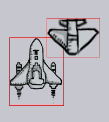

# JustWeEngine - Android遊戲框架
An easy open source Android Native Game FrameWork.   
  
[](https://android-arsenal.com/details/1/2903)[ ](https://jitpack.io/#lfkdsk/JustWeEngine)

## 引擎核心類流程圖  
  
## 使用方法  
* 引入Engine作為Library進行使用。
* 引入"/jar"文件夾下的jar包。  
* 使用Gradle構建:  
  * Step 1. Add the JitPack repository to your build file  
  Add it in your root build.gradle at the end of repositories:  
  
  ``` groovy  
  
    	allprojects {
			repositories {
				...
				maven { url "https://jitpack.io" }
			}
		}
   	
  ```
  
  * Step 2. Add the dependency  on
  
  
  ``` groovy
  
      dependencies {
	        compile 'com.github.lfkdsk:JustWeEngine:v1.05beta'
	  }
		
  ```
* 使用Maven構建:  
  * Step 1. Add the JitPack repository to your build file  
  
  ``` xml
  
    <repositories>
		<repository>
		    <id>jitpack.io</id>
		    <url>https://jitpack.io</url>
		</repository>
	</repositories>
  
  ```
  
  * Step 2. Add the dependency  
  
  ``` xml
  	
    <dependency>
	    <groupId>com.github.lfkdsk</groupId>
	    <artifactId>JustWeEngine</artifactId>
	    <version>v1.05beta</version>
	</dependency>
	
  ```

## 引擎進入V1.10版本

* 以之開發的微信打飛機遊戲Demo：[Demo地址](https://github.com/lfkdsk/EngineDemo)  
* 很多額外控件：[JustWeTools](https://github.com/lfkdsk/JustWeTools)  
* 網絡功能的Demo：[JustWe-WebServer](https://github.com/lfkdsk/JustWe-WebServer)  
* StudioVSEclipse([ice1000](https://github.com/ice1000))：[StudioVSEclipse](https://github.com/ice1000/StudioVSEclipse)    

## 快速入門  

* [1.基礎功能](#1基礎功能)
	* [1.1繼承引擎核心類](#11繼承引擎核心類)
	* [1.2繪製文字](#12繪製文字)
	* [1.3繪製圖片](#13繪製圖片)
	* [1.4使用精靈](#14使用精靈)
	* [1.5使用按鈕](#15使用按鈕)
* [2.動畫系統](#2動畫系統)
	* [2.1綁定在BaseSub物品及精靈基類上的動畫類](#21綁定在basesub物品及精靈基類上的動畫類)
	* [2.2綁定在Button上的動畫類](#22綁定在button上的動畫類)
* [3.物體分組碰撞檢測和死亡判定](#3物體分組碰撞檢測和死亡判定)
* [4.屏幕掃描模式](#4屏幕掃描模式)
* [5.工具類](#5工具類)
* [6.音頻系統](#6音頻系統)  
	* [6.1播放短音效](#61播放短音效)
	* [6.2播放音頻](#62播放音頻)
	* [6.3通過短音效編曲](#63通過短音效編曲)

## 進階應用
* [7.使用網絡](#7使用網絡)  
* [8.使用狀態機精靈](#8使用狀態機精靈)  
* [9.CrashHandler崩潰守護](#9crashhandler崩潰守護)
* [10.使用藍牙](#10使用藍牙)
    * [10.1開啟、關閉服務](#101開啟關閉服務)
    * [10.2掃描設備](#102掃描設備)
    * [10.3發送消息](#103發送消息)  
* [11.SQLite數據庫](#11SQLite數據庫)
	* [11.1創建表](#111創建表)
    * [11.2增刪查改](#112增刪查改)  
    
## 拓展功能  
* [允許玩家繪製](#允許玩家繪製)  
* [流程腳本](#流程腳本)

### 1.基礎功能
#### 1.1繼承引擎核心類： 
   由於框架全部使用SurfaceView進行繪製，不使用諸如Button、Layout等原生控件，所以應該首先新建類繼承引擎核心類Engine，負責遊戲的流程，注釋中已有明確的標明功能。  
   
``` java

	public class Game extends Engine {
	// 一般在構造函數完成變量的初始化
    public Game() {
    	// 控制debug模式是否開始，debug模式打印日誌、幀數、pause次數等信息
        super(true);
        
    }
	
	// 載入一些UI參數和設置屏幕放向，默認背景色，設定屏幕的掃描方式等
    @Override
    public void init() {
    	// 初始化UI默認參數，必須調用該方法，其中有一些用於多機型適配的參數需要初始化
        UIdefaultData.init(this);
    }

	// 通常用於精靈，背景，圖片等物體的設置和載入
    @Override
    public void load() {

    }

	// draw 和 update 在線程中進行不斷的循環刷新
	// draw 負責繪製 update 負責更新數據和對象信息
    @Override
    public void draw() {

    }

    @Override
    public void update() {

    }
	
	// 將touch 事件傳回 功能和所設定的屏幕掃描方式有關
    @Override
    public void touch(MotionEvent event) {

    }
    
	// 將碰撞事件傳回 傳回精靈和物品的基類 
	// 用於處理碰撞事件 默認使用矩形碰撞
    @Override
    public void collision(BaseSub baseSub) {

    }
    }

```   
  
#### 1.2繪製文字：
    
使用GamePrinter進行文字繪製,除此以外還有多種方法繪製:  
  
``` java

    @Override
    public void draw() {
        Canvas canvas = getCanvas();
        GameTextPrinter printer = new GameTextPrinter(canvas);
        printer.drawText("哈哈哈", 100, 100);
    }
    
```  
效果圖：  
  

#### 1.3繪製圖片：
建議圖片存放在Asset中：  
``` java  
	GameTexture texture = new GameTexture(this);
	texture.loadFromAsset("pic/logo.jpg")
	texture.draw(canvas, 100, 100);
```  
效果圖：    
  
另外也可使用`loadFromAssetStripFrame`從一個大的圖片中取出對應位置的圖片。  

``` java

	/**
     * get bitmap from a big bitmap
     *
     * @param filename
     * @param x
     * @param y
     * @param width
     * @param height
     * @return
     */
    public boolean loadFromAssetStripFrame(String filename,
                                           int x, int y,
                                           int width, int height)
```  
比如可以通過這四個參數把這個小飛機取出來： 
  
  
PicUtils中提供了在Bitmap處理中很有用的各種特效和壓縮方法，大家可以一試。  

#### 1.4使用精靈：
  使用精靈可以使用BaseSprite也可以繼承該類使用，BaseSprite封裝了很多方法供各種動畫使用，這些功能很多都是需要結合動畫系統來使用的，動畫系統會在後面介紹。  
##### 新建精靈：
  1.簡單初始化:  
  ``` java
  
          sprite = new BaseSprite(this);
          
  ```
  2.初始化連續幀動畫：  
  連續幀的初始化需要這樣的連續幀圖片:  
  
  
  ``` java 
  
        GameTexture texture = new GameTexture(this);
        texture.loadFromAsset("pic/zombie.png");
        // 長寬以及列數
        sprite = new BaseSprite(this, 96, 96, 8);
        sprite.setTexture(texture);
        sprite.setPosition(100, 100);
        sprite.setDipScale(100, 100);
        // 幀切換動畫是關鍵
        sprite.addAnimation(new FrameAnimation(0, 63, 1));
        addToSpriteGroup(sprite);
        
  ```
  
  效果圖:  
    
  3.使用從大圖取出的多幀圖片： 
  ``` java  
  
    	// 新建圖片資源（此圖為上圖的大圖）
        GameTexture texture = new GameTexture(this);
        texture.loadFromAsset("pic/shoot.png");
        // 初始化設定模式和長寬
  		ship = new BaseSprite(this, 100, 124, FrameType.COMMON);
  		// 設定資源
        ship.setTexture(texture);
        // 從大圖中取出兩幀
        ship.addRectFrame(0, 100, 100, 124);
        ship.addRectFrame(167, 361, 100, 124);
        ship.addAnimation(new FrameAnimation(0, 1, 1));

  ```
  效果圖(兩幀圖片不斷切換):  
    

  4.一些重要的其他設定：
    
  ``` java  
  
  	  // 圖片資源
  	  ship.setTexture(texture);
  	  // 大圖取幀模式
  	  ship.addRectFrame(0, 100, 100, 124);
  	  // 設定位置
  	  ship.setPosition(x, y);
  	  // 設置dp大小
      ship.setDipScale(96, 96);
      // 設定dp位置
	  ship.setDipPosition(x, y);
	  // 設定透明度
	  ship.setAlpha(...);
	  // 只有將精靈添加到SpriteGroup中框架才會自行繪製，否則需要手動調用
	  addToSpriteGroup(ship);
	  ...
	  
  ``` 

#### 1.5使用按鈕：  
  使用的按鈕可以繼承BaseButton進行拓展，也可以直接使用TextureButton和TextButton進行使用。  
  Button設定功能的方式和原生一樣，通過設定接口回調的方式進行：
  ``` java  
  
  		button.setOnClickListener(new OnClickListener() {
          @Override
          public void onClick() {
              Log.e("button", "onClick");
          }
        });
        
  ```
  1.TextureButton: 
   
  ``` java  
  
      TextureButton button;
      // 初始化並設定名字
      button = new TextureButton(this, "logo");
	  texture = new GameTexture(this);
      texture.loadFromAsset("pic/logo.jpg");
      // 添加圖片資源
      button.setTexture(texture);
      // button的接口回調，不是View的那個接口
      button.setOnClickListener(new OnClickListener() {
          @Override
          public void onClick() {
              Log.e("button", "onClick");
          }
        });
      button.setPosition(200, 300);
      button.setDipScale(100, 150);
      // 添加到ButtonGroup進行繪製和處理
      addToButtonGroup(button);

  ``` 
  效果圖:  
    
    結合PicUtil中的各種Bitmap處理方法可以很容易的做出各種樣式的Button：  
    
  
  2.TextButton:  
  
  ``` java  
  	  
      TextButton button;  
      button = new TextButton(this, "logo");
      button.setText("劉豐愷");
      addToButtonGroup(button);
      // 余略見源碼
	  ...
	  
  ```
  效果圖：  
  

### 2.動畫系統  
  目前的動畫系統可以使用已經封裝好的繼承了BaseAnimation的動畫，也可以繼承BaseAnim進行自我定義動畫類進行使用。  
#### 2.1綁定在BaseSub物品及精靈基類上的動畫類  
AnimType中保存了Animation的應用類型。

| Animation     | method        |function|
| ------------- |:-------------:|-------:|
| AliveAnimation|adjustAlive(boolean ori) | 碰撞檢測的時候進行判斷存活狀態 |
| AlphaAnimation|adjustAlpha(int ori)     | 修改物體透明度              |
| CircleMoveAnimation | adjustPosition(Float2 ori)| 沿某一圓心進行圓周運動 |
| FenceAnimation | adjustPosition(Float2 ori)| 使用圍欄動畫防止出界 |
| FrameAnimation | adjustFrame(int ori) | 逐幀動畫 |
| MoveAnimation | adjustPosition(Float2 ori) | 位移動畫 |
| SpinAnimation | adjustRotation(float ori) | 旋轉動畫 |
| ThrobAnimation | adjustScale(Float2 ori) | 跳躍動畫 |
| VelocityAnimation | adjustPosition/adjustAlive | 線性加速度計 |
| WrapMoveAnimation | adjustPosition(Float2 ori) | 圍欄動畫防止出界 |
| ZoomAnimation | adjustScale(Float2 ori) | 放大縮小動畫 |
| 待續 | ... | ... |

綁定動畫分為兩類，ListAnimation和FixedAnimation,ListAnimation將動畫存儲到固定的一個List中，用於重複更新的動畫，
而FixedAnimation存儲在Map中，使用名字進行調用，用於點擊或者非自動更新的動畫。
比如前面精靈類動畫的就是添加到ListAnimation。
下面的這種寫法就是FixedAnimation，這個動畫是小飛機入場，因為只使用了一次，所以使用了FixedAnimation。
``` java

        ship.addfixedAnimation("start",
                new MoveAnimation(UIdefaultData.centerInHorizontalX -   ship.getWidthWithScale() / 2,
                        UIdefaultData.screenHeight - 2 * ship.getHeightWidthScale(), new Float2(10, 10)));
           
```

效果圖:  
  

#### 2.2綁定在Button上的動畫類  
BaseButtonAnimation是BaseButton的動畫類繼承了BaseAnim的動畫基類，通過提供Button的狀態，設定Button的動畫。

| Animation        | method           | function  |
| ------------- |:-------------:| -----:|
| ZoomCenterButtonAnim |adjustButtonRect(Rect ori,boolean touchType) | 按鈕放縮動畫 |
| ColorAnimation|adjustButtonBackGround(int ori,boolean type)| TextButton點擊變色 |
| 待續 | ... | ... |

為Button設定放縮動畫:  
``` java

	// 設定中心放縮
    button.setZoomCenter(true);
    // 三個參數 初始值／放大值／幀數
    button.setAnimation(new ZoomCenterButtonAnim(10, 30, 3));
	
```
效果圖:  
    

為Button設定顏色動畫:  

``` java

	// 初始顏色 ／ 按下顏色
	button.setAnimation(
       new ColorAnimation(UIdefaultData.colorAccent,
       UIdefaultData.colorPressed));

```
效果圖:  
    

### 3.物體分組碰撞檢測和死亡判定
使用設置ID和Name進行物體分組，通過物體分組，框架核心類會對對象進行分類處理。
``` java

	final int SHIP = 0;
	ship.setName("SHIP");
    ship.setIdentifier(SHIP);

```

只要使用了`addToSpriteGroup(sprite)`的精靈對象就會自動進行碰撞檢測，而對碰撞檢測的結果會從
`collision`中進行發回。
``` java

    @Override
    public void collision(BaseSub baseSub) {
    	// 獲取與之碰撞的對象
        BaseSprite other = (BaseSprite) baseSub.getOffender();
        // 獲取ID分組處理
        if (baseSub.getIdentifier() == BULLET &&
                other.getIdentifier() == ENEMY) {
            // 設定死亡
            other.setAlive(false);
            // 回收
            removeFromSpriteGroup(other);
            addToRecycleGroup(other);
        }
    }
    
```

其中`getOffender()`獲得與之碰撞的對象，通過`getIdentifier()`獲取設定的對象分組，實行邏輯判斷。
開啟Debug模式會看見碰撞線。  
效果圖:  

### 4.屏幕掃描模式  
屏幕掃描模式是用來優先響應屏幕點擊、Button點擊、和多點觸控而設的，放置在不同情況下都能優化屏幕的刷新。  
``` java

  	// 檢測單一移動
  	SINGLE,
  	// 檢測Button
    BUTTON,
    // 多點檢測
    FULL,
    // 單擊＋Button
    SINGLE_BUTTON
  
```
並且通過如下方式進行設置:  

``` java
	
	super.setTouchMode(TouchMode.BUTTON);

``` 


### 5.工具類  
   * `NetUtils` 網絡狀態工具類
   * `PicUtils` 圖片處理工具類
   * `ServiceUtils` 服務工具類
   * `ImageHelper` 圖型處理類  
   * `DisplayUtils` 數據轉換類
   * `SpUtils` Sp簡化工具類（`可存儲list和map`）
   * `ValidatorsUtils` 正則表達式處理類  

### 6.音頻系統  
#### 6.1播放短音效 
播放短音效，首先初始化`SoundManager`用以加載音效。  
``` java

	// 接收實例和Manager的尺寸
    SoundManager manager = new SoundManager(this, 5);
    // 從assets加載音頻 同時加載路徑也會作為音效名進行存儲
	manager.addSound("mic/open.mid");
	// 通過加載名進行播放
	manager.play("mic/open.mid");
	
	
```

完成以上步驟就可以播放了，當然盡量只向其中放置較短的音效，如背景音樂的長音頻，請見播放音頻。  

``` java

	public void removeSound(String musicName) // 移除
	public void play(String musicName, float volume) // 播放 ＋ 音量
	public boolean containSoundID(int soundID) // 判斷音頻是否存在
	public int getSoundID(String soundName)  // 獲取ID
	...


```  
#### 6.2播放音頻  
播放音頻適合例如背景音樂一樣的音樂。  

``` java  

	// 傳入兩個參數 上下文和文件名
	MusicPlayer player = new MusicPlayer(this, "mic/open.mp3");
    player.play();

```  
以上的就能實現播放了，下面還有一些其他的方法。

``` java  

	public void dispose() // 清理
	public void setLooping(boolean isLooping) // 是否循環
	public void setVolume(float volume) // 設定音量
	...
	
```  

#### 6.3通過短音效編曲  
從`SoundManager`中導入多段音頻，快速播放達成音效的效果。

``` java 

    SoundManager manager = new SoundManager(this, 5);
    manager.addSound("mic/1.mid");
    manager.addSound("mic/2.mid");
    SoundPlayer player = new SoundPlayer(manager, 500, 16);
    player.addSound("mic/1.mid");
    player.addSound("mic/2.mid");
    ... 

```

使用`player.play();`進行播放。


### 7.使用網絡
網絡的使用可參考[JustWe-WebServer](https://github.com/lfkdsk/JustWe-WebServer)中的介紹。
按照介紹操作就可以通過：
 
``` java
  
        server.apply("/lfk", new OnWebStringResult() {
            @Override
            public String OnResult() {
                return "=======";
            }
        });

        server.apply("/main", new OnWebFileResult() {
            @Override
            public File returnFile() {
                return new File(WebServerDefault.WebServerFiles+"/"+"welcome.html");
            }
        });
        
```  
        
這樣的簡單方式綁定路由，而get／post數據可以直接使用http協議的get和post進行。

### 8.使用狀態機精靈

``` java

    // 為狀態機添加一個任務
    sprite.addState(new StateFinder() {
        @Override
        public boolean isContent(BaseSub baseSub) {
            return Math.abs(zom.s_position.x - baseSub.s_position.x) > 50;
        }
    }, new FrameAnimation(0, 63, 1));

```
  
可以通過上述的addState方法為狀態機精靈添加一個任務，只有當第一個參數接口回調的返回值為真的時候，
才會去運行第二個參數提供的指令，如果返回為假則會運行第二項狀態的判斷。
狀態的優先級由加入順序提供。

效果圖:  
    

### 9.CrashHandler崩潰守護  
CrashHandler用於處理遊戲的意外崩潰事件，初始化推薦在Application中進行。
CrashHandler可以自動保存機型和異常日誌，以便讓開發者找到問題所在。

``` java

    CrashHandler.getInstance().init(this);

```
使用以上語句即可自動保存錯誤日誌。
還可以:

``` java
        
    CrashHandler.getInstance().setRestartActivity(MainActivity.class); // 重啟的Activity
    // 添加崩潰回調
    CrashHandler.getInstance().addCrashListener(new AfterCrashListener() {
        @Override
        public void AfterCrash() {  // 設定保存項目
            ...
        }
    });    

```

### 10.使用藍牙

#### 10.1開啟、關閉服務
使用藍牙需要新建`BlueToothServer`對象，傳入上下文和MessageBack接口。

``` java

        blueToothServer = new BlueToothServer(this, new OnMessageBack() {
            @Override
            public void getMessage(String msg) {
                Log.e("L", msg);
            }

            @Override
            public void sendMessage(String msg) {
                Log.e("L", msg);
            }

            @Override
            public void getDevice(ArrayList<String> msg) {
                Log.e("L", msg.size() + "");
            }
        });
		
		// 使用如下語句進行初始化
        blueToothServer.init();

```  
服務初始化之後如未打開藍牙，系統會自動提示應用要求藍牙開啟。

通過MessageBack接口可以接收到發送、接收、以及掃描設備信息，採取對應操作就可以獲得數據。

關閉服務時請使用`blueToothServer.unBindService();`關閉服務。

#### 10.2掃描設備 
使用`blueToothServer.doDiscovery();`進行設備掃描，返回結果在OnMessageBack()接口的
getDevice()方法接收。
使用`blueToothServer.ensureDiscoverable();`允許被掃描。
使用`blueToothServer.getPairedDevices();`返回已配對的設備列表。

#### 10.3發送消息
在配對成功之後就可以使用`blueToothServer.sendMessage(String msg);`發送消息了。
同時，消息的接收也可以從getMessage()接口中獲得。  

### 11.SQLite數據庫  

SQLite使用了IOC的模式。

#### 11.1創建表

新建的創建表需要繼承Node並且寫出註解類。  

``` java  
	
	// 表名
	@TableName(tableName = "lfkdsk")
	public class User extends Node {

	// 主鍵自增 INTEGER型
    @LabelName(autoincrement = true,
            type = LabelName.Type.INTEGER,
            columnName = "name",
            generatedId = true)
    private int name;
	
	// TEXT型 欄名為user_name
    @LabelName(type = LabelName.Type.TEXT,
            columnName = "user_name")
    private String user_name;

	// 自增主鍵所以只需要提供其他信息
    public User(String user_name) {
        super(user_name);
        this.user_name = user_name;
    }

    public User(int name, String user_name) {
        super(name, user_name);
        this.name = name;
        this.user_name = user_name;
    }

    public int getName() {
        return name;
    }

    public void setName(int name) {
        this.name = name;
    }

    public String getUser_name() {
        return user_name;
    }

    public void setUser_name(String user_name) {
        this.user_name = user_name;
    }
	}

```


``` java  

	// 通過這種方式獲取數據庫   表名
    private DataBase dataBase = DataBase.initAndOpen("user", User.class);


```

#### 11.2增刪查改

``` java  

	// add
	database.insert(User user);
	// find
	database.get(int position);
	// delete
	database.delete(int position);
	// update
	database.update(User user);
	...

```

## 擴展功能

### 允許玩家繪製
可接受用戶的繪製輸入，並以之生成精靈、背景、或其他對象：[如何使用？](https://github.com/lfkdsk/JustWeTools#paintview畫圖工具)  

### 流程腳本  

```   
	用以控制人物對話或其他流程的腳本，目前能設定變量，使用簡單的表達式，還有分支結構的功能
	，等我好好刷完龍虎書再填坑。
	
```


##有問題反饋
在使用中有任何問題，歡迎反饋給我，可以用以下聯繫方式跟我交流

* 郵件:lfk_dsk@hotmail.com  
* weibo: [@亦狂亦侠_亦温文](http://www.weibo.com/u/2443510260)  
* 博客:  [劉丰愷](http://www.cnblogs.com/lfk-dsk/)  

## License

    Copyright 2015 [劉丰愷](http://www.cnblogs.com/lfk-dsk/)

    Licensed under the Apache License, Version 2.0 (the "License");
    you may not use this file except in compliance with the License.
    You may obtain a copy of the License at

       http://www.apache.org/licenses/LICENSE-2.0

    Unless required by applicable law or agreed to in writing, software
    distributed under the License is distributed on an "AS IS" BASIS,
    WITHOUT WARRANTIES OR CONDITIONS OF ANY KIND, either express or implied.
    See the License for the specific language governing permissions and
    limitations under the License.